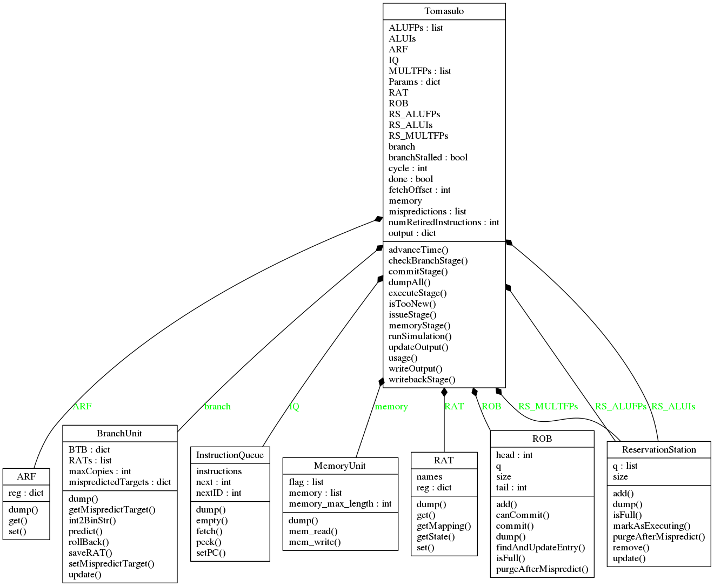

# Tomasulo-Softcore
This is our project submission for a single-core soft CPU running Tomasulo's Algorithm with re-ordering buffers, speculative execution, and memory disambiguation.  This work was prepared for the graduate-level computer architecture course, ECE2162, at the University of Pittsburgh.

# Software Requirements
The project assumes you are running a terminal with Python 3.6+ in the CLI path and execution privileges.  To generate new UML images using the makeUML script, you will need graphviz and pylint3 installed and available in your path.

# Build Instructions
To run the project with a test input, type:
`<python 3> Tomasulo.py test1.txt`
where <python 3> is your python 3 CLI interpreter and test1.txt is a valid input file

# Test Cases
The test cases incrementally test that all instructions are properly supported, that the algorithm is executing correctly, and that the additional features are performing their respective tasks correctly.  The test cases are organized into the tests directory by prefix; test1_input.txt and test1_expected.txt designate the input test case file and the hand-derived output expected for that test case.

To test individual modules in the src directory, run them directly as scripts:
`<python 3> ROB.py`

# Status
- The project is currently under active development
- The project is not in a working state

# Tasks
## Major Functional Units 
- [x] Input Parsing
- [x] ROB class
- [x] RS class
- [ ] RAT class
- [x] Integer ALU class
- [ ] FP Adder class
- [ ] FP Multiplier class
- [x] Instruction Queue class
- [ ] Branch Unit class
- [ ] Memory Unit class
- [ ] Integer Register File
- [ ] FP Register File
- [ ] Output Generator
- [ ] Issue procedure
- [ ] Execute procedure
- [ ] Memory procedure
- [ ] Writeback procedure
- [ ] Commit procedure

## Test Cases
- [ ] Simplest test case: execute a single ALU instruction end-to-end
- [ ] Simple ISA test case: ALU end-to-end
- [ ] Simple ISA test case: FPALU end-to-end
- [ ] Simple ISA test case: FP Multiplier end-to-end
- [ ] Simple ISA test case: Load/Store end-to-end
- [ ] Simple ISA test case: Branch end-to-end
- [ ] Addressing corner cases test
- [ ] Verify absence of WAW test case
- [ ] Verify absence of WAR test case
- [ ] Verify handling of RAW test case
- [ ] Verify memory disambiguation
- [ ] Verify illegal instructions fail
- [ ] Complex test case: all instructions
- [ ] Complex test case: single speculation fail
- [ ] Complex test case: multiple speculation fail
- [ ] Complex test case: chained speculation; fail in middle
- [ ] Complex test case: extended length loop
- [ ] Complex test case: write patterns to memory
- [ ] Complex test case: Fibonacci numbers recursive

## Stretch Goals
- [ ] Implement all operands as binary numbers
- [ ] Implement all instructions as binary numbers
- [ ] Implement true addressing
- [ ] Implement virtual addressing
- [ ] Extend FP multiplier to divide
- [ ] Assemble profiles with latencies of functional units in common architectures
- [ ] Add support for pseudo-instructions
- [ ] Implement remaining MIPS ISA
- [ ] Add exceptions handling

# Project Requirements
[See here](rubric.md)

# Description of Operation
Our software hierarchy is depicted below in the UML diagram.  To handle the requirement that some functional units are pipelined and others are not, we replicate time-tracking in the subclasses and functional units; cycles are counted and incremented by the top-level Tomasulo class, and for functional units that have time sensitive actions, an advanceTime() function is used to progress by one time unit.

