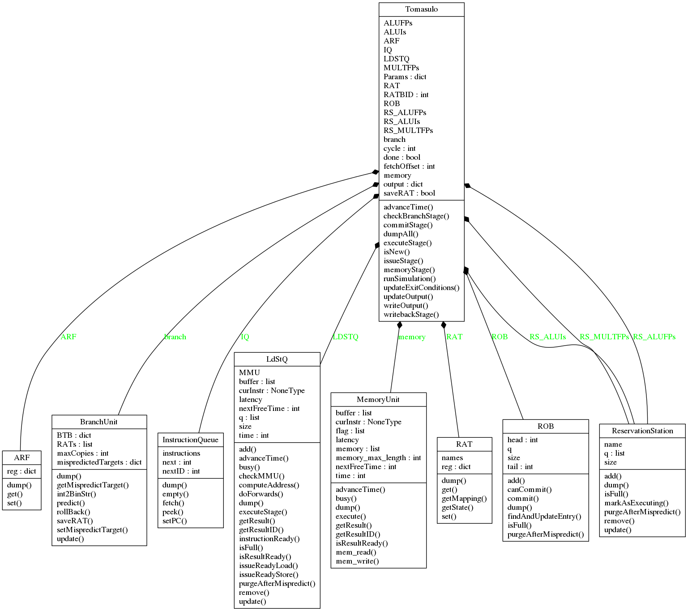
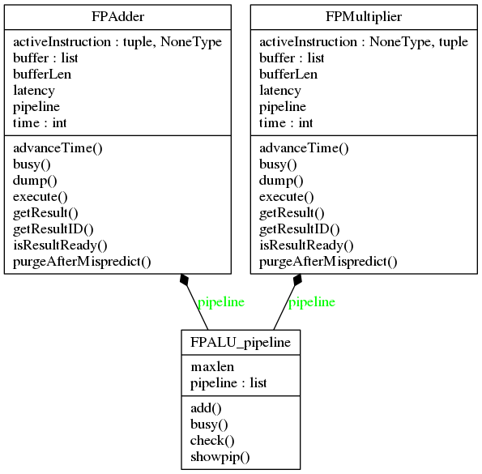
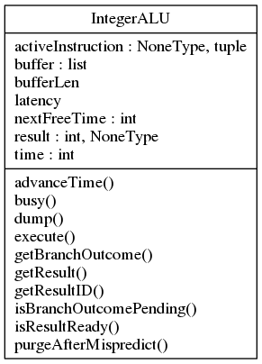
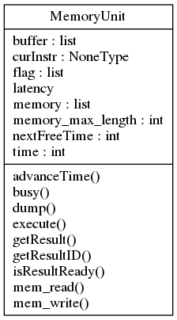
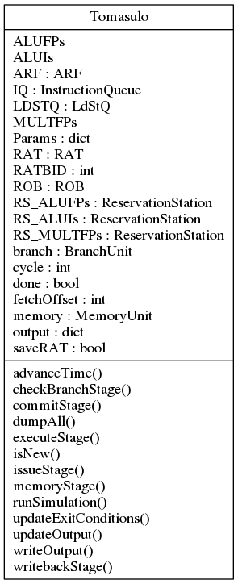

# UML Documentation
Our class designs are shown here for reference.

## System Hierarchy

## Architecture Register File

## Branch Unit

## Floating Point Unit

## Instruction Queue

## Integer ALU

## Memory Unit

## Register Allocation Table

## Re-Order Buffer

## Top-Level Class

